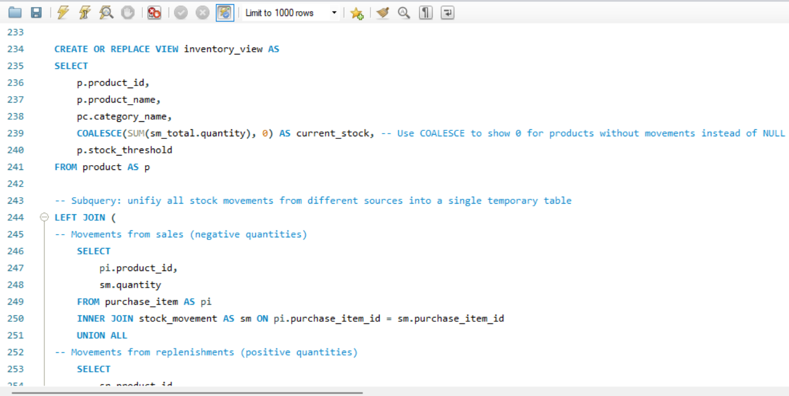
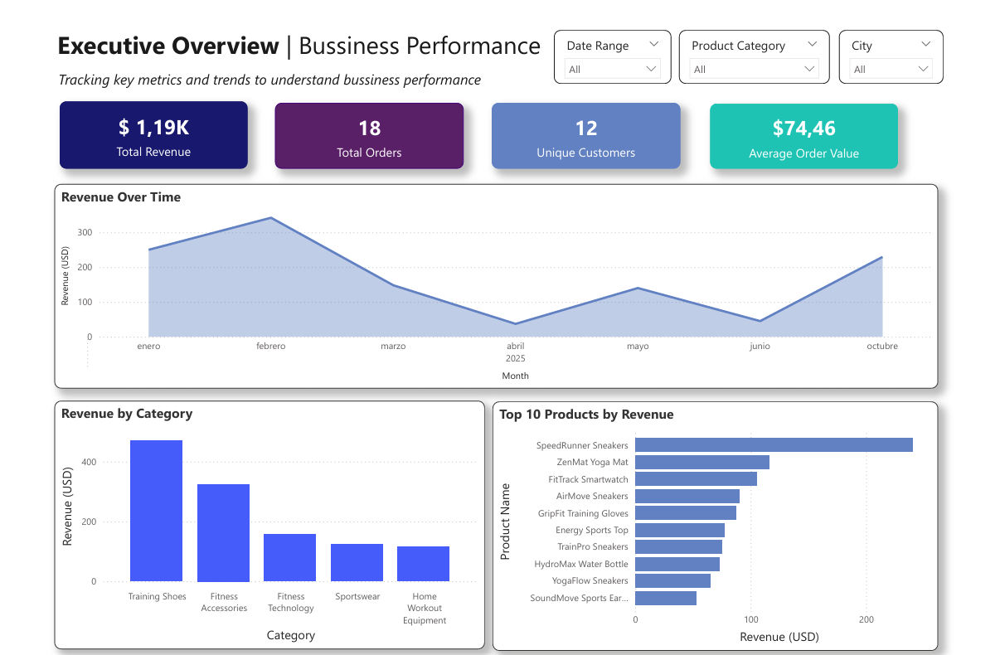
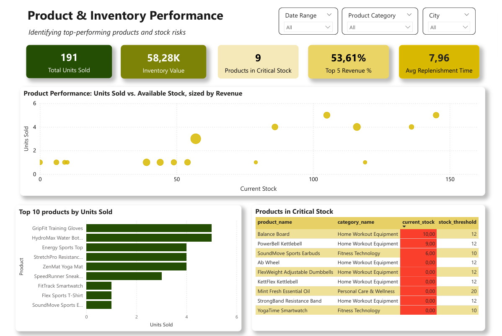

# NexusVit E-Commerce Database Project

## Business Case
NexusVit is a fictional e-commerce startup focused on sportswear and lifestyle products in Canada.
The company operates online and manages products, inventory, sales, suppliers, and customer behavior.

### Project Goal
The Operations & Sales team needed a system to:  
- Register clients and their purchases  
- Track products, categories, prices, and stock  
- Manage suppliers and inventory replenishments  
- Automatically update stock when sales are completed  
- Identify products with critical stock levels  

### Analytical Reports
- **Daily Sales Report**: captures paid orders, customer info, and detailed product sales  
- **Product & Inventory Analysis**: total sales per product, inventory levels, critical stock alerts  
- **Customer Insights**: top customers, purchase frequency, inactive clients  
- **Replenishment Tracking**: products restocked, supplier info, time to restock  
- **Mailing Lists for Marketing**: customers with at least one paid purchase  

> For full details, see the complete Bussiness Case: [Full Business Case PDF](Docs/NexusVit-Case.pdf)

---

## Project Scope 
This project demonstrates an end-to-end data workflow, from database design to analytical reporting, covering transactional activity, inventory management, and customer behavior analysis.

**Key assumptions:**
- Delivery and shipping processes are not modeled in this version.
- Purchase lifecycle is simulated: orders start as **Pending**, then transition to **Paid** or **Cancelled**.
- Stock is dynamically calculated using triggers on purchases and replenishments.

---

## Tech Stack
- Draw.io: Relational database diagramming
- MySQL: DDL, DML (including ETL), reports
- Power BI: Data modeling, DAX measures, visualization
- Google Sheets: Workflow organization

---

## Data & System Design

### Dataset
The database was populated with simulated records from **January to October 2025** for a small e-commerce business. Public datasets were not used, as the goal was to design the database schema from scratch and populate it according to realistic business rules. Controlled data quality issues, such as **nulls, duplicates, unusual characters, and logical inconsistencies**, were intentionally added to simulate real-world scenarios and enable the development of ETL and data cleaning steps.

### Project Scripts
The project is organized into separate SQL files, each representing a different phase of the data workflow:

- **ddl.sql**: Defines schema, including tables, relationships, constraints, triggers and analytical views.
- **dml.sql**: Populates the database, simulates transactions and performs data cleaning operations (ETL).
- **reports.sql**: Contains analytical queries and business reports for key operational and strategic questions.

### Database Structure
The database models core e-commerce operations with **11 key tables** covering products, customers, purchases, suppliers, and stock management:

- **product** and **product_category** store information about the catalog and product classifications.
- **customer** captures client details, while **purchase** and **purchase_item** record all transactional activity.
- **payment_method** and **purchase_status** are lookup tables containing valid payment types and purchase statuses.
- **supplier** and **product_supplier** manage supplier relationships and sourcing.
- **stock_replenishment** records inventory additions.
- **stock_movement** records stock reductions from purchases and additions from replenishments, enabling accurate inventory tracking.

### Data Model Design
- **Price Handling (Current vs Historical)**: The product table stores current prices, while **purchase_item** stores the price at the time of purchase, preserving historical accuracy even when prices change.
- **Backend Logic Simulation**: Since this project is implemented entirely in SQL without an application backend, several backend responsibilities are simulated directly in MySQL to replicate real-world system behavior.
- **Purchase Lifecycle**: Purchases start with a Pending status and transition to Paid or Cancelled through UPDATE operations, simulating a real-world order flow and triggering stock updates.
- **Stock Replenishment Modeling**: The **stock_replenishment** table records completed restocking events, while critical stock is treated as a logical condition (based on a threshold) and surfaced in the BI dashboard to identify low-stock products.
- **Automated Stock Updates**: Stock changes are handled automatically through two triggers: one reduces stock when a purchase is marked as Paid, and another increases stock when a replenishment is recorded. Each movement is timestamped, providing a reliable historical record for inventory analysis.
- **Inventory as a View**: Inventory is implemented as a dynamic view rather than a physical table, allowing stock to be calculated in real time from stock movements and replenishments without duplicating data.
- **Normalization Strategy**: The model is fully normalized to ensure data integrity. For this project, prioritizing normalization keeps the design clean, while in larger production systems, controlled denormalization may be required to improve performance and scalability.

---

## ETL Process
It was developed in three main phases:

1. **Data Quality Assessment**: Duplicate purchase records, null values in product descriptions and categories, anomalies in stock replenishments, and invalid formats in customer emails and phone numbers were identified.
2. **Data Cleaning Phase**: Duplicate records were removed, available null values were completed, and inconsistencies corrected. Other issues, such as low replenishment quantities, delayed restocks, or invalid contact formats were documented for review or left for external validation.
3. **Validation**: Confirms that business rules are followed and the dataset is consistent.

This process also revealed opportunities to improve database design, such as implementing constraints to prevent replenishments with insufficient quantities or illogical dates, as well as operational alerts.

---

## Analytical Reports
The SQL reports transform transactional data into actionable insights across key business areas: sales, product performance, inventory control, customer behavior, replenishment, and marketing outreach. Specific reports include daily sales activity, category and product rankings, current stock levels and total inventory value, stock alerts, inactive customer identification, and simulated customer contact lists for analytical purposes.

### SQL Preview 
  

---

## BI Integration
A Power BI dashboard was built using a MySQL database connection to visualize key metrics and explore business performance. The dashboard is supported by SQL queries, which handle data preparation and enable more complex analysis beyond Power BI’s native capabilities.

### Dashboard Preview
  
  

**[View Dashboard PDF](Dashboard/NexusVit_Dashboard.pdf)**

---

## Key Insights
- **Revenue is highly seasonal**, peaking in January–February and October, with a sharp ~89% drop from February to April. This suggests implementing targeted promotions during low-demand periods to stabilize sales throughout the year.  
- **Training Shoes dominates sales**, while Home Workout Equipment significantly underperforms. Increasing visibility, optimizing pricing, and bundling it with top-selling items could help improve its performance.  
- **Domestic customers drive most conversions**, while international users show interest but experience high cart abandonment. Possible barriers includes high delivery costs, long delivery times, or limited payment options.  
- Inventory value (58.28K) is significantly higher than total revenue (1.19K), which may indicate **slow inventory turnover or overstocking**. This highlights the need to optimize inventory management and better align stock levels with demand.  
- There is no clear relationship between units sold and current stock, suggesting **inventory is not aligned with demand**, with risks of overstocking low-performing products and stock shortages for high-demand items.  
- Five out of 30 products generate 53.61% of total revenue, indicating a **strong dependency on a small subset of products**. Diversifying revenue sources and reducing reliance on top performers could improve business stability.  
- Only 3.3% of customers were active in the last 90 days, highlighting **low customer retention** and the opportunity to implement targeted strategies such as loyalty programs, personalized promotions, or remarketing campaigns.  
- To support this, the dashboard provides a table identifying customers without recent paid purchases, providing key information for marketing teams to target retention efforts, loyalty programs, and personalized promotions to re-engage inactive clients.

---

## Future Improvements
- **Purchase Status History Analysis**: The analysis of purchase status transitions was left outside the current scope. Future work could explore how orders evolve over time, enabling metrics such as payment confirmation times, cancellation rates, and other operational insights.
- **More Flexible Stock Movement Modeling**: The current design uses foreign keys in **stock_movement** to ensure strong traceability and referential integrity, linking each movement to a valid source event. In a production environment with a backend layer, a more flexible approach could be adopted by introducing a `movement_type` field. This would support additional inventory events, such as refunds or inventory corrections, and provide a more scalable and realistic model while preserving analytical value.

---

## How to Navigate

1. Start with the business case document (`business-case.pdf`) to understand the project objectives and context.  
2. Review the SQL scripts (`ddl.sql`, `dml.sql`, `reports.sql`) to see the database structure, sample data (simulated data for testing), and analytical queries.  
3. Check the database schema (`database-schema.pdf`) to visualize the relational model.  
4. Access the Power BI dashboard (`dashboard.pbix`) to explore key KPIs and visualizations.  
5. Optionally, consult the screenshots (`images/`) for quick reference used in the README.

---

## Appendix
The complete SQL scripts used in this project are available in the repository, including database creation (DDL), data population and cleaning (DML), and analytical queries. The code is documented with comments for those who want to explore the implementation in more detail.
