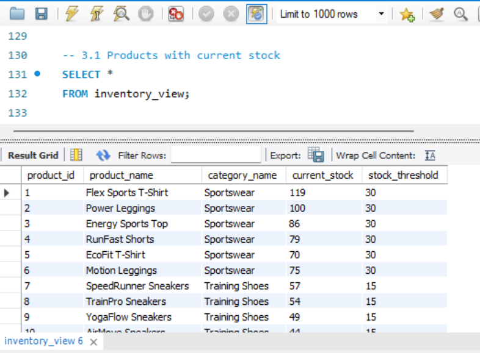

# NexusVit E-Commerce Database Project

## Project Scope
**NexusVit** is a fictional e-commerce company focused on sportswear and lifestyle products in North America.  
This project demonstrates an **end-to-end data workflow**, from database design to analytical reporting, covering transactional activity, inventory management, and customer behavior analysis.

**Key assumptions:**
- Delivery and shipping processes are not modeled in this version.  
- Purchase lifecycle is simulated: orders start as **Pending**, then transition to **Paid** or **Cancelled**.  
- Stock is dynamically calculated using triggers on purchases and replenishments.  

---

## Data & System Design

### Dataset
The database was populated with simulated records from **January to October 2025** for a small e-commerce business.  
Public datasets were not used, as the goal was to design the database schema from scratch and populate it according to realistic business rules.  

Controlled data quality issues, such as **nulls, duplicates, unusual characters, and logical inconsistencies**, were intentionally added to simulate real-world scenarios and enable the development of ETL and data cleaning steps.  

---

### Project Scripts
The project is organized into separate SQL files, each representing a different phase of the data workflow:

- **`ddl.sql`**: Defines schema, including tables, relationships, constraints, triggers, and analytical views.  
- **`dml.sql`**: Populates the database, simulates transactions, and performs data cleaning operations (ETL).  
- **`reports.sql`**: Contains analytical queries and business reports for key operational and strategic questions.  

---

### Database Structure
The database models core e-commerce operations with **11 key tables** covering products, customers, purchases, suppliers, and stock management:

- **product** and **product_category** store information about the catalog and product classifications.  
- **customer** captures client details, while **purchase** and **purchase_item** record all transactional activity.  
- **payment_method** and **purchase_status** are lookup tables containing valid payment types and purchase statuses.  
- **supplier** and **product_supplier** manage supplier relationships and sourcing.  
- **stock_replenishment** records inventory additions.  
- **stock_movement** records stock reductions from purchases and additions from replenishments, enabling accurate inventory tracking.  

---

### Data Model Design
- **Price Handling (Current vs Historical):** Product table stores current prices, while `purchase_item` stores the price at the time of purchase.  
- **Backend Logic Simulation:** Implemented entirely in SQL without an application backend. Several backend responsibilities are simulated directly in MySQL.  
- **Purchase Lifecycle:** Purchases start with **Pending** status and transition to **Paid** or **Cancelled** through `UPDATE` operations, triggering stock updates.  
- **Stock Replenishment Modeling:** `stock_replenishment` table records completed restocking events. Critical stock is treated as a logical condition surfaced in the BI dashboard.  
- **Automated Stock Updates:** Two triggers handle stock changes (one reduces stock on Paid purchases, another increases stock on replenishment).  
- **Inventory as a View:** Inventory is implemented as a dynamic **view**, calculated in real time from stock movements and replenishments.  
- **Normalization Strategy:** Fully normalized to ensure data integrity.  

---

## ETL Process
**Three main phases:**

1. **Data Quality Assessment:** Identify duplicates, nulls, anomalies, and invalid formats.  
2. **Data Cleaning Phase:** Remove duplicates, complete nulls, correct inconsistencies, document remaining issues.  
3. **Validation:** Confirms business rules are followed and the dataset is consistent.  

> This process also revealed opportunities to improve database design, such as constraints to prevent illogical replenishments.

---

## Analytical Reports
The SQL reports transform transactional data into **actionable insights** across key business areas:

- **Sales, product performance, inventory control, customer behavior, replenishment, marketing outreach**  
- Examples: daily sales activity, category and product rankings, current stock levels, stock alerts, inactive customer identification, simulated customer contact lists.  

### SQL Screenshots
Here’s a snapshot of some key queries:
 
  
 

---

## BI Integration
A **Power BI dashboard** was built using a MySQL connection to visualize key metrics and explore business performance.  

    

[View Dashboard PDF](Dashboard/NexusVit_Dashboard.pdf)

---

## Key Insights
- Revenue is highly seasonal, peaking in Jan–Feb and Oct, with ~89% drop from Feb to Apr.  
- **Training Shoes** dominate sales; **Home Workout Equipment** underperforms.  
- Domestic customers drive most conversions; international users show high cart abandonment.  
- Inventory value (58.28K) is much higher than total revenue (1.19K), indicating slow turnover or overstocking.  
- Five products generate 53.61% of total revenue, highlighting dependency on top performers.  
- Only 3.3% of customers were active in the last 90 days, showing opportunity for targeted retention strategies.  

---

## Future Improvements
- **Purchase Status History Analysis:** Track order transitions over time for metrics like cancellation rates.  
- **More Flexible Stock Movement Modeling:** Introduce `movement_type` to support refunds, corrections, and scalable inventory events.  

---

## Appendix
The complete SQL scripts are available in this repository:  

- **Database creation (DDL)**  
- **Data population and cleaning (DML)**  
- **Analytical queries (reports.sql)**  

The code is documented with comments for those who want to explore implementation details.
